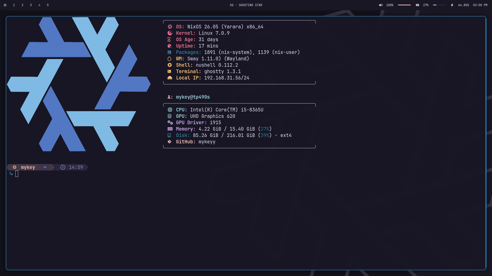

.. image:: https://img.shields.io/badge/NixOS-Unstable-blue.svg?style=for-the-badge&logo=NixOS&logoColor=white
   :target: https://nixos.org
.. image:: https://img.shields.io/badge/Theme-Rosé%20Pine-ebbcba.svg?style=for-the-badge&logo=visual-studio-code&logoColor=191724
   :target: https://rosepine.style
.. image:: https://img.shields.io/badge/Hardware-ThinkPad%20T490s-red.svg?style=for-the-badge&logo=lenovo&logoColor=white
.. image:: https://img.shields.io/badge/Engine-import--tree-c4a7e7.svg?style=for-the-badge

mykey-nix-conf
==============

My personal NixOS configuration for my daily-driver ThinkPad T490s.
It's built with a dendritic modular layout, styled around the Rosé Pine color scheme, and is designed so I can rebuild the entire system with a single command.

Showcase
--------

About
-----

I switched to NixOS in early 2025 because I got tired of watching Windows slow down with every update and having to set everything up manually from scratch. Now everything I need is declared in this flake. If my machine ever breaks, I can get back to exactly where I left off.

This setup isn't over-engineered or complex—it's just a student configuration that gets the job done. It borrows the flat leaf module structure from my friend's `invra/inc` repo and the dendritic pattern from `mightyiam/infra`.

Features
--------

* We style the system around Rosé Pine using Stylix, with some extra manual tweaks for Ghostty, Discord (via nixcord), and my terminal music player (spotify-player).
* The modules follow a dendritic layout managed by import-tree, meaning all modules are auto-imported unless skipped with an underscore prefix.
* I run SwayFX for custom blur and shadows, Hyprland (with Intel-specific optimizations), and Plasma 6 as my fallback session.
* Rebuilds and upgrades are handled cleanly using the nh helper tool.

.. note::
   This flake uses ``import-tree`` to auto-discover and load Nix modules. Any sub-modules prefixed with an underscore (like ``_shell.nix`` or ``_hardware.nix``) are ignored by the auto-importer and must be imported manually in ``default.nix``. This keeps the system evaluations clean and structured.

Structure
---------

.. code-block:: text

   ├── configurations/tp490s/    Host-specific hardware and kernel settings
   ├── modules/
   │   ├── nixos/                 System-wide services (greetd, stylix, pipewire, audio...)
   │   ├── home/                  Home-manager user modules (_shell, _terminal, _bar...)
   │   └── docs/                  reStructuredText documentation
   ├── configs/                   eww config, starship prompt, kanshi profiles, and scripts
   └── wallpapers/                Wallpaper images and screenshots

Sessions
--------

======= =========================================================================
Session Highlights and integrations
======= =========================================================================
SwayFX  Window blurring, rounded corners, drop shadows, and an eww bar
Hyprland Intel-tuned performance, dwindle layout, and hy3 tabbed window groups
Plasma 6 Full KDE Plasma 6 desktop session styled with Rosé Pine
======= =========================================================================

Rebuilding the system
---------------------

To rebuild the entire system:

.. code-block:: bash

   sudo nixos-rebuild switch --flake ~/.nix#tp490s

Or use the fast ``nh`` helper alias:

.. code-block:: bash

   rebuild            # Rebuild system configuration
   rebuild --update   # Update flake inputs and rebuild

To apply user-level home-manager edits only:

.. code-block:: bash

   nh home switch ~/.nix

Links
-----

* `Documentation (SKILL.md) <./SKILL.md>`_
* `invra/inc <https://github.com/invra/inc>`_ — Module style inspiration
* `mightyiam/infra <https://github.com/mightyiam/infra>`_ — Dendritic pattern origin
* `import-tree <https://github.com/denful/import-tree>`_ — Auto-import engine

.. _invra/inc: https://github.com/invra/inc
.. _mightyiam/infra: https://github.com/mightyiam/infra
.. _import-tree: https://github.com/denful/import-tree
